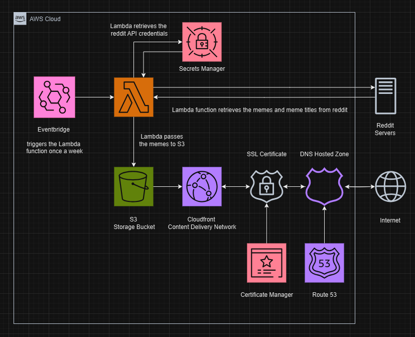

# Meme Displayinator 9000
## memedisplayinator9000.com
_Made by Breanna Chase_

### Description:
Are you feeling anxious or stressed? Has the amount of tickets and projects felt overwhelming?

Now is your chance to forget all of that and laugh all of your fears away with the all new MemeDisplayinator9000! This incredible tool shamelessly scrapes and steals the best IT memes every week from all of the greatest IT meme subreddits and compiles them in a slideshow on the website memedisplayinator9000.com for your viewing pleasure! Replace the nearest Amazon operations ACID feed and immerse yourself in IT comedy today!

(Batteries not included, terms and restrictions don’t apply, source code is allegedly located here: github.com/NerdyAndIKnowIt/MemeDisplayinator9000)

### Boring Tech Jargon

### FAQ
- Q: Is this legal?
- A: Yes, this tool uses the Reddit API and is a registered and approved reddit app.

- Q: What kind of memes does this take? 
- A: Currently just IT and software development related memes, if you want me to make a specific version such as a cute kitten and puppy version lmk.

- Q: What Reddit subs do these IT memes come from?
- A: This may change in the future, but currently: r/iiiiiiitttttttttttt, r/ProgrammerHumor, r/ShittySysadmin, r/Sysadminhumor, r/windowsmemes, r/cablegore, r/networkingmemes, r/linuxmasterrace, r/programmingmemes

- Q: Are there any content filters?
- A: Not currently that is part of my code, but each sub I take these memes from have their own rules for posting content. No irrelavent memes will be upvoted in groups that large. The script ran by the lambda function every week only selects the top memes each month. I may add content restrictions in the future if it becomes an issue.

- Q: How frequently do new IT memes get added to the slideshow?
- A: Each week the lambda function executes a script to retrieve the top memes of the last month.

### Changelog

- v0.01 - tried unsuccessfully to validate the reddit api credentials
- v0.02 - authentication issue fixed, next step is downloading the images and building a test website on my personal computer
- v0.03 - created the DownloadImages function and am trying to test it
- v0.04 - added title file handling, tests successful for downloading images and writing text
- v0.05 - working on the functions to delete the old memes, started on the frontend
- v0.06 - created the function to delete the old memez before getting the new ones
- v0.07 - completed the frontend and tested it successfully with DesktopDownloadTest.py
- v0.08 - added all the terraform website infrastructure
- v0.09 - used the test code from DesktopDownloadTest.py to create the lambda package, preinstalled all of the lambda package dependencies into the same folder
- v0.10 - added cross origin resource sharing to the S3 and cloudfront to get the javascript slideshow to work
- v0.11 - fixed a deprecation issue with cross origin resource sharing on the S3 bucket
- v1.00 - First working version, fixed a cross origin resource permissions issue with the S3 bucket
- v1.01 - fixed a permissions issue with the lambda function accessing secrets manager
- v1.02 - added readme and architecture diagram

### Known Issues and TODO

- CSS does not adjust properly to some monitor sizes and could be better
- mobile support